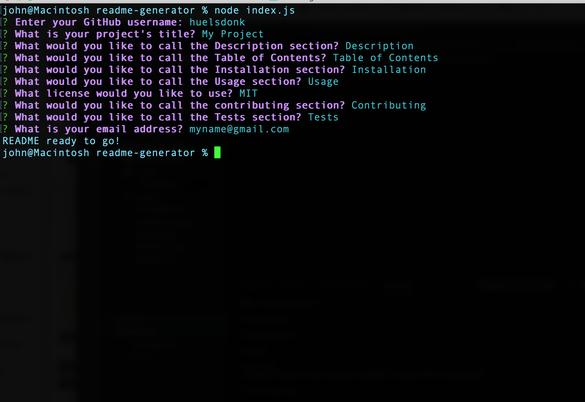

# README Generator
    
# Table of Contents
#### [Description](#Description)    
#### [Installation](#Installation)    
#### [Usage](#Usage)    
#### [License](#license)
#### [Contributing](#Contributing)    
#### [Tests](#Tests)    

# Description
    This application takes inputs from the user and generates a README.md file.
# Installation
    This application runs in Node.js and requires Inquirer.js and Axios. The README is written to a folder called "output".
# Usage
    Free to use, please help yourself
# License

    
# Contributing
    Just me
# Tests
    Nope

##### Email: 
huntsperger@gmail.com

